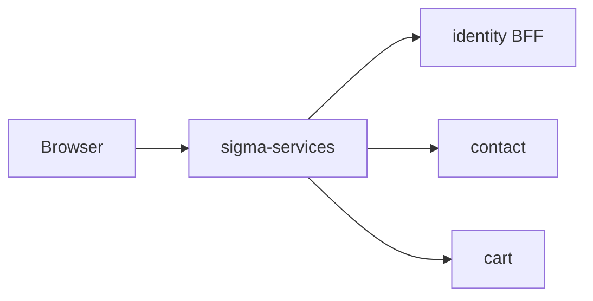

# sigma-services architecture

`sigma-services` is the public professional-services site for vehicle maintenance, consulting, and research and development. Browsers use it directly; its shared navigation links to the identity BFF, contact service, and storefront-related cart service.

## Context

This service owns no database: its health routes are registered without a pool.

## Runtime shape

`src/main.rs` hands the route filter to `sigma_theme::warp::run_service`, which builds the multithreaded Tokio runtime, takes the listen address from `PORT`, and serves until shutdown.

This is a stateless Warp service. The `include_dir` crate embeds the complete `content/` tree at build time, and `OnceLock` values retain the parsed registry, navigation, cards, and rendered index page for the lifetime of the process.

## Request flow

`routes()` joins `index_page()` at `GET /` and `service_page()` at `GET /service/{slug}` before passing them through `site_routes`, shared security headers, and themed rejection handling. The resulting service also provides `/up`, `/health`, static theme assets, and the favicon.

`service_page()` retrieves the slug through `content::get()`. It returns Warp's not-found rejection for an unknown offering; otherwise `templates::render_service_html()` renders the embedded Markdown body and sidebar. Inquiry buttons are generated with an absolute return URL for the contact service.

## Code map

| Path | Responsibility |
| --- | --- |
| `src/main.rs` | Names the service and hands its routes to the theme's `run_service`. |
| `src/lib.rs` | Defines site filters and adds theme, health, CSP, and error handling. |
| `src/config.rs` | Reads public URL and navigation-service URLs. |
| `src/content.rs` and `src/content/service_entry.rs` | Embed, parse, order, and look up Markdown service offerings. |
| `src/templates.rs` and `src/templates/*.rs` | Render the index and detail templates with site chrome, cards, sidebar, breadcrumbs, and contact URLs. |
| `content/*.md` | Build-time source for the available service pages. |
| `templates/*.html` | Askama templates for the index and service pages. |

## Data

This service is stateless and owns no PostgreSQL schema or tables. Offering Markdown is compiled into the binary and converted to HTML during registry initialisation.

## Configuration

| Environment variable | Purpose |
| --- | --- |
| `PORT` | Listen port supplied to the theme crate. |
| `SERVICES_PUBLIC_BASE_URL` | Public base URL used in the shared chrome and contact return URL. |
| `SERVICES_IDENTITY_PUBLIC_URL` | identity BFF URL used by navigation and CSP `connect-src`. |
| `SERVICES_CART_PUBLIC_URL` | Cart-service URL used by shared chrome. |
| `SERVICES_CONTACT_PUBLIC_URL` | Contact-service URL used by shared chrome and inquiry links. |

## Deployment

`Dockerfile` builds the `sigma-services` image. Kubernetes resources are in `../platform/services/services/base/`: the Deployment declares image `sigma-services:local` and container port `8080`; the Service maps port `80` to it. Readiness and liveness probes use `GET /up`.

Public routing and dev, staging, and production configuration are in `../platform/services/services/`. See [`../platform/README.md`](../platform/README.md) for the shared Gateway, Istio, and hostname model.

`scripts/prepare-local.sh` prepares a sibling theme checkout for local development. `scripts/docker-build.sh` and `scripts/prepare-image-context.sh` create the image build context; CI is defined in `.github/workflows/ci.yml`.

## Testing

Run `cargo test`. The route tests verify the offering list, service-detail rendering, unknown-slug `404`, absolute contact return URLs, and `GET /up`.

The tests use Warp's in-process request harness. They do not require PostgreSQL or a running contact-service instance because contact URLs are only rendered, not fetched.

## Design notes

- Professional-service content is immutable at runtime because it is embedded in the executable.
- A `BTreeMap` provides slug lookup while display order remains explicit through front-matter `order`, then title.
- Cached render fragments avoid repeated template work for static content.
- Contact links use absolute public URLs because the contact allowlist does not accept a bare path as a return target.
- The shared chrome includes the cart even though this service itself has no commerce-state dependency.
